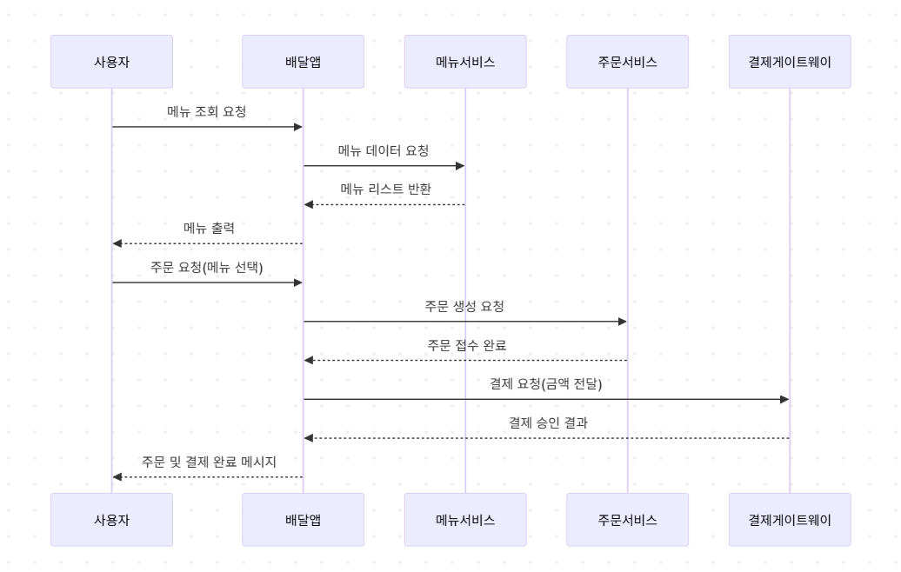

# 음식 배달 앱 (Food Delivery App)

일상 속 소프트웨어 사용 사례를 주제로 음식 배달 앱을 정함.
사용자는 터미널 환경에서 메뉴 선정, 음식을 주문, 결제를 완료하는 과정을 체험할 수 있다.

앱의 흐름은 아래와 같다.
1. 앱 실행
2. 음식 메뉴 목록 출력
3. 사용자가 음식 선택 (입력)
4. 주문 생성 메시지 출력
5. 결제 시뮬레이션 및 완료 메시지 출력


## 📁 폴더 구조

```
food_delivery_app/
├── food_delivery_app.py
├── menu_service.py
├── order_service.py
├── payment_gateway.py
```

# 응집도 / 결합도 평가 
```
응집도 평가
각 모듈(MenuService, OrderService, PaymentGateway)은 각각 메뉴 목록 제공, 주문 생성, 결제 처리라는 단일 기능에만 집중하도록 설계되어 있다.
이처럼 기능별로 명확히 분리되어 있어, 높은 응집도를 유지하고 있다.

결합도 평가
메인앱(FoodDeliveryApp)은 각 모듈(MenuService`, `OrderService`, `PaymentGateway`)이 내부 구현 방식에 의존하지 않고, 메서드만 호출하면 기능을 사용할 수 있다.
즉 모듈간의 결합을 느슨하기 때문에, 낮은 결합도를 유지하고있다.
```
# mermaid.live 코드
```
sequenceDiagram
    participant 사용자
    participant 배달앱
    participant 메뉴서비스
    participant 주문서비스
    participant 결제게이트웨이

    사용자->>배달앱: 메뉴 조회 요청
    배달앱->>메뉴서비스: 메뉴 데이터 요청
    메뉴서비스-->>배달앱: 메뉴 리스트 반환
    배달앱-->>사용자: 메뉴 출력

    사용자->>배달앱: 주문 요청(메뉴 선택)
    배달앱->>주문서비스: 주문 생성 요청
    주문서비스-->>배달앱: 주문 접수 완료

    배달앱->>결제게이트웨이: 결제 요청(금액 전달)
    결제게이트웨이-->>배달앱: 결제 승인 결과
    배달앱-->>사용자: 주문 및 결제 완료 메시지
```
# 시퀀스 다이어그램

이 앱의 흐름을 나타내는 시퀀스 다이어그램


